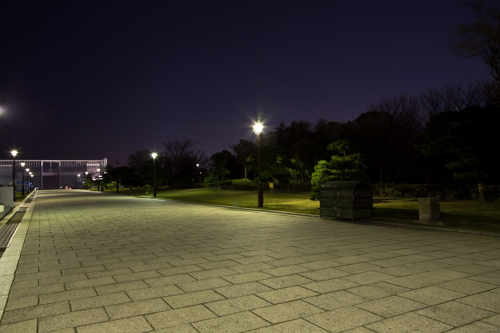

# Sample

<!--
# 背景を指定する場合は以下のようにする
-->

<!--
headingDivider: 1
color : #FFAABB
# 各プロパティの先頭に"_"を付けると、該当ページのみスタイルが変わる
_backgroundColor : #EEEEEE
-->

# Section1

<!-- 
# 左に画像を表示
-->

<!--
_footer : hoge
-->

This page is Section1.

# Section2

<!-- 
# 右に画像を表示
-->

<!--
_header : fuga
# 途中で"_"を付けないプロパティを指定すると、以降のページ全てに反映
color : red
-->

This page is Section2.

#

blank page.